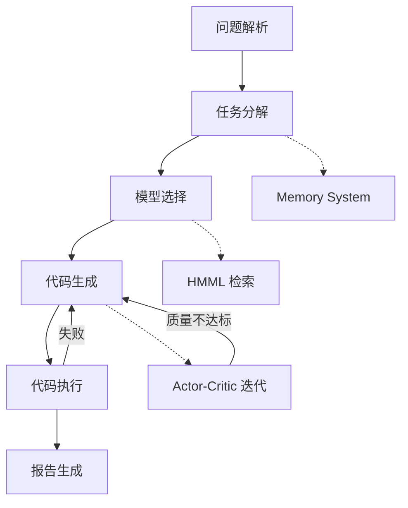

# Feature Landscape

**Domain:** 自动化数学建模系统 (Mathematical Modeling Automation)
**Researched:** 2026-04-10
**Confidence:** MEDIUM (基于 MM-Agent 论文和 LLM-MM-Agent 仓库分析)

## Executive Summary

数学建模自动化系统的核心价值在于将非结构化赛题转化为完整的数学模型和论文报告。根据 NeurIPS 2025 收录的 MM-Agent 研究，自动化数学建模需要四个阶段：问题分析 → 数学建模 → 计算求解 → 报告生成。表必须有完整的端到端流水线，差异化则体现在知识库检索质量、迭代改进机制和与 Claude Code 的深度集成。

## Table Stakes

用户期望的基础功能。缺失这些功能，产品无法成立。

| Feature | Why Expected | Complexity | Notes |
|---------|--------------|------------|-------|
| 问题解析 | 接收 PDF/MD/TXT 赛题，提取问题背景、目标、约束条件 | High | 需要 PDF 解析、文本结构化 |
| 任务分解 | 将复杂问题分解为子问题，构建依赖 DAG | High | 数学建模特有需求，子问题间存在依赖 |
| 数学模型选择 | 根据问题类型选择合适的建模方法 | High | 需要领域知识库支持 |
| 代码生成 | 生成可执行的 Python/数值计算代码 | High | 需要理解数学公式并转化为代码 |
| 代码执行 | 运行生成的代码，处理错误，返回结果 | Medium | 需要沙盒环境或安全执行机制 |
| 报告生成 | 输出 LaTeX/PDF 格式的论文报告 | Medium | 学术竞赛标准格式要求 |

## Differentiators

非必须但能带来竞争优势的功能。

| Feature | Value Proposition | Complexity | Notes |
|---------|-------------------|------------|-------|
| HMML 知识检索 | 分层数学建模库，98+ 方法节点，支持问题感知和方案感知检索 | Very High | MM-Agent 核心创新，需预计算 embedding |
| Actor-Critic 迭代 | 模拟专家审视过程，通过迭代改进提升生成质量 | High | 单次生成质量不稳定，需要多轮反馈 |
| Memory System | 任务间上下文传递，依赖任务结果加载 | Medium | DAG 执行时，上游任务输出需被下游消费 |
| 多智能体协作 | 不同 Agent 负责不同阶段，专业化分工 | Medium | 复用 GSD 框架的 Agent 编排模式 |
| Claude Code 集成 | 继承 Claude Code 模型配置，无需单独 API Key | Low | 差异化于独立部署的 MM-Agent |
| 错误恢复 | 代码执行失败后自动重试或修复 | Medium | 迭代式错误处理机制 |

## Anti-Features

明确不做的功能，避免资源分散。

| Anti-Feature | Why Avoid | What to Do Instead |
|--------------|-----------|-------------------|
| Web UI (Django/Flask) | CLI-first 定位，v1 不需要可视化界面 | 专注 CLI 体验，使用 Claude Code 原生交互 |
| 独立 Python CLI | 目标是 Claude Code 插件，非独立部署 | 集成到 Claude Code Skills/Hooks 体系 |
| 100% MM-Agent 功能对齐 | 聚焦核心流水线，复刻而非全面创新 | 优先保证端到端流程可跑通 |
| 数据库持久化 | 增加部署复杂度，当前阶段不需要 | 使用 JSON 文件存储状态 |
| LangGraph/LangChain | GSD 框架已提供更好的编排模式 | 使用 GSD 的 phase/plan/execute 模式 |
| 实时可视化界面 | 复杂度高，非竞赛场景刚需 | 报告中的静态图表足够 |

## Feature Dependencies

**依赖链说明：**
- 问题解析 → 任务分解：结构化输出是分解输入
- 任务分解 → 模型选择：子问题依赖影响模型选择
- 模型选择 → 代码生成：数学模型决定代码结构
- 代码生成 → 代码执行：生成代码需执行验证
- 代码执行 → 报告生成：数值结果是报告素材

**反馈回路：**
- 代码执行失败 → 代码生成（重试/修复）
- Actor-Critic 质量不达标 → 代码生成（迭代改进）
- HMML 检索辅助模型选择（非强依赖，可选）

## MVP Recommendation

优先实现的核心功能集，确保端到端流程可跑通。

### 必须实现 (MVP)

1. **问题解析** - 接收赛题文件，输出结构化 problem.md
2. **任务分解** - 分解子问题，构建 DAG，确定执行顺序
3. **代码生成 + 执行** - 生成 Python 代码并运行，返回结果
4. **报告生成** - 输出基础 LaTeX/PDF 报告

### 建议实现 (v1)

5. **HMML 检索** - 预计算 embedding，支持方法检索
6. **Memory System** - 任务间上下文传递
7. **Actor-Critic 迭代** - 简单实现（max_rounds=3）

### 推迟实现 (v2+)

- 完整 HMML 知识库构建（当前可使用简化版）
- 多模型支持（DeepSeek 等）
- 高级错误恢复机制

## Sources

- [MM-Agent Paper (arXiv 2505.14148)](https://arxiv.org/abs/2505.14148) — NeurIPS 2025 收录的四阶段数学建模框架
- [LLM-MM-Agent Repository](https://github.com/usail-hkust/LLM-MM-Agent) — 开源实现，包含 HMML 和 Actor-Critic 机制
- [MM-Agent HuggingFace Demo](https://huggingface.co/spaces/mmagents/MM-Agent) — 在线演示

## Confidence Assessment

| Area | Confidence | Reason |
|------|------------|--------|
| Table Stakes | HIGH | 基于 MM-Agent 论文和项目需求明确 |
| Differentiators | MEDIUM | HMML/Actor-Critic 来自 MM-Agent，Claude Code 集成为本项目特有 |
| Anti-Features | HIGH | 已在 PROJECT.md 中明确 Out of Scope |
| Dependencies | MEDIUM | 基于数学建模工作流的逻辑推导 |