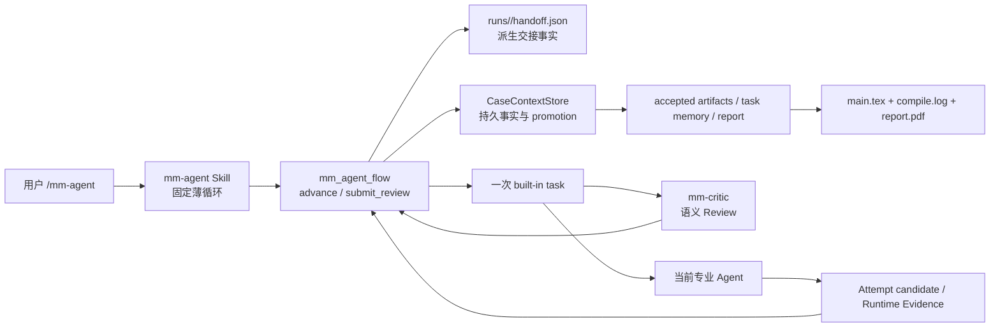

# 正式运行面收敛规格

状态：Locked for implementation  
基线：`7e33dd8ba8e53a814a573c3f14461bf98799ba16`  
范围：`mm-agent` 中用户执行 `/mm-agent` 后的正式运行路径

## 结论

正式运行面采用“一个薄协调深模块 + 五个 OpenCode hidden Agents + 角色专用 Tools + Case 文件交接”。协调模块只决定下一步并维护机器事实，专业 Agent 负责分析、建模、求解、写作和语义审查。

不新增第六个 Coordinator Agent，不让 Golden runner 进入产品 runtime，不通过更长的自然语言 prompt 模拟状态机，也不在首条纵向闭环中启用并行 Solver wave。

## 最小架构



OpenCode `task` 仍是 fresh child session 的唯一宿主机制。Plugin 不绕过 built-in `task` 私自模拟 child session。当前 OpenCode Plugin 接口没有“从 Plugin hook 直接执行 built-in task”的受支持接口，因此正式 Skill 保留一次机械的 Task 调用；协调模块通过待执行指令和 `tool.execute.before` 校正该 Task 的 Agent、description 与 prompt，消除主模型临场编排。

## 正式调用链

1. `/mm-agent` 调用 `mm_agent_check` 和 `mm_agent_prepare`，创建新 Case 或恢复唯一明确的 active Case。
2. Skill 调用 `mm_agent_flow { action: "advance", case_id }`。
3. Flow 从 `state.json`、active Attempt、accepted artifacts 和 DAG 推导下一动作。
4. 若需要 Actor 或 Critic，Flow 返回一条完整 Task Directive，并把同一事实写入 `handoff.json`。
5. Skill 使用 OpenCode built-in `task` 恰好一次；Plugin 在 `tool.execute.before` 用本会话待执行 directive 校正 `subagent_type`、`description` 和 `prompt`。
6. Agent 只读取 directive 指向的 `context.json` 和其中声明的文件；Actor 写 candidate，Critic 只返回语义 JSON。
7. Skill 再次调用 Flow。Flow 验证 Actor 约定输出；完整则派 Critic，不完整则恢复同一 Actor Attempt。
8. Skill 将 Critic 的四个语义字段提交给 `mm_agent_flow { action: "submit_review", ... }`。Flow 生成 `schema_version`、`attempt_id`、`reviewed_at` 和当前 revision，执行 evidence allowlist 校验并调用 Core Gate。
9. Flow 根据 pass / revise / block 立即计算下一 directive 或终态，更新 `handoff.json`。
10. Reporting pass 只有在 `main.tex`、`compile.log`、成功 Compile Evidence 和非空 `report.pdf` 全部成立时才能完成 Case。

用户路径不调用 `scripts/run-golden-case.mjs`。Golden runner 继续作为开发期验收工具，通过内部 Core 接口运行。

## 五个 Agent 合同

| Agent | 输入 | 输出 | 专用 Tool | 交接责任 |
|---|---|---|---|---|
| `mm-analyst` | immutable input manifest、题目与附件、Analysis Rubric | `problem-understanding.md`、`tasks.json`、`task-graph.json` | 无 | 把题目转成明确任务和合法 DAG；不派发下一 Agent |
| `mm-modeler` | immutable input、accepted Analysis、当前 modeling context | `modeling-scheme.md`、任务级 `retrieved-methods.json` | `mm_agent_hmml` | 选择并论证方法；检索只作证据 |
| `mm-solver` | 当前 task、accepted model、直接依赖 Task Memory | code、figures、`execution-result.json`、`memory.json` | `mm_agent_compute` | 实际执行当前任务并留下可复算 Evidence |
| `mm-writer` | accepted artifacts、全部 accepted Task Memory、Reporting Rubric | `outline.md`、`notation.md`、`main.tex`、`compile.log`、`report.pdf` candidate | `mm_agent_compile` | 从 accepted facts 写报告并真实编译 |
| `mm-critic` | 同一 Attempt 的 candidate、声明的 upstream、Rubric、合法 Runtime Evidence | `verdict`、`findings`、`required_fixes`、`evidence` | 无写入 Tool | 只做语义判断；不生成机器字段、不写文件、不 Gate、不委派 |

Agent prompt 只描述身份、领域职责、工具和完成定义。精确路径、Attempt、read set、write set 与输出列表来自 runtime 生成的 `context.json`，不得在 Task prompt 中重新定义。

## Flow 深模块接口

模型可见接口只保留两个 action：

```ts
type FlowInput =
  | { action: "advance"; caseId: string }
  | {
      action: "submit_review"
      caseId: string
      verdict: "pass" | "revise" | "block"
      findings: string[]
      requiredFixes: string[]
      evidence: string[]
    }
```

Flow 返回以下一种结果：

- `task`：包含唯一的 `agent`、`description`、`prompt`、`attempt_id` 和 `context_path`。
- `blocked`：包含当前 blocker 和需要用户补充的事实。
- `failed`：包含确定性错误，不自动重试 Gate。
- `completed`：包含最终报告路径和 completion evidence。

`expected_revision`、`base_revision`、`attempt_id`、`schema_version` 和时间戳不再出现在 Skill 或 Critic 的接口中。

## 最小持久状态

权威事实继续是：

- `case.json`：Case 身份、immutable input、Policy 与 Rubric snapshot。
- `state.json`：当前 stage/status、accepted artifact index 与兼容所需 revision。
- active Attempt 的 `context.json`：当前负责人、目标、required reads、expected outputs 和允许写入。
- accepted artifacts、Task Memory、Compute/Compile Evidence。
- `report/main.tex`、`report/compile.log`、`report/report.pdf`。

新增 `handoff.json` 是由 Flow 从上述权威事实重建的派生投影，不是第二套状态机。它至少记录：

```json
{
  "schema_version": 1,
  "case_id": "example",
  "status": "awaiting_actor",
  "current_agent": "mm-modeler",
  "next_agent": "mm-critic",
  "attempt_id": "modeling-001",
  "context_path": "attempts/modeling/001/context.json",
  "required_reads": [],
  "expected_outputs": [],
  "updated_at": "runtime-generated UTC RFC 3339"
}
```

Flow 每次调用都允许覆盖该投影，使其重新与权威文件一致。其他模块不得把 `handoff.json` 当作 promotion 或 completion 的依据。

## Resume 语义

新 OpenCode 会话重新执行 `/mm-agent`：

1. 恢复现有 Case，不复制旧聊天。
2. `advance` 重新 inspect 权威磁盘事实并重写 `handoff.json`。
3. active Attempt 的 expected outputs 不完整：恢复同一 Actor 和同一 `context.json`，不 dispatch 新 Attempt。
4. expected outputs 完整但尚无 Review：直接派 fresh Critic，不重跑 Actor。
5. 没有 active Attempt：按当前 state/DAG dispatch 唯一下一 Actor。
6. Case completed：只返回最终报告与 completion evidence，不重派任何 Agent。

首条正式链中的 Solver task 按 DAG 可执行顺序串行运行。DAG 仍表达依赖，但不启用同 wave 并发；并发不是证明正式用户路径可用的前置条件。

## Critic 退回规则

- `revise` 永远退回当前 Attempt 的 Actor：Analysis→Analyst，Modeling→Modeler，`solving/<task-id>`→同一 Solver task，Reporting→Writer。
- Critic 不返回 target stage；Flow 根据 active Attempt scope 决定负责人，避免让模型控制路由字段。
- 若问题可在当前 candidate 内修复，返回 `revise`。
- 若证据表明 immutable input 缺失，或 accepted upstream 已错误到当前 candidate 无法诚实修复，返回 `block`。v1 不自动回滚已 accepted stage；修复需要补充输入并创建新 Case，或未来通过显式 reopen/migration 机制完成。
- `pass` 只接受当前 candidate，不表示对未声明文件或整个 Case 的泛化背书。

## Review evidence allowlist

Flow 在 Gate 前把每条 evidence 规范化为 Case-relative path，并要求它属于当前交接声明的以下集合之一：

1. Manifest candidate / review required reads；目录声明允许其真实后代文件。
2. Manifest required reads 中的 immutable input 或 accepted upstream artifact。
3. 当前 Manifest 的 Rubric。
4. 当前 Attempt `evidence/` 下通过 `RuntimeEvidenceSchema` 与 hash 校验的 Evidence manifest。

仅“Case 内路径存在”不再足够。绝对路径、`..`、未声明的 `tmp/`、其他 Attempt、其他 Case、任意 stable 文件和自然语言描述全部拒绝。evidence 必须非空；`pass` 至少引用一个 candidate，`block` 若缺 candidate 必须引用有效失败 Runtime Evidence。

## Gate 边界

不是每次 Agent 交接都运行 Gate：

- Actor → Critic：只检查 Manifest expected outputs 是否存在，是候选完整性检查。
- Critic → accepted fact：运行一次 Gate，负责 schema、路径、Evidence、promotion 和完成条件。
- accepted fact → next Actor：Flow 根据新 state 路由，不再增加第二个 Gate。

语义判断留给 Critic；Gate 不判断建模方法好坏。Agent 的鲁棒性用于理解、推导、修复和表达，确定性 guardrail 只保护不可变输入、路径、可复算 Evidence、promotion 和最终 PDF 完成事实。

## 现有机制处置

| 机制 | 决定 | 理由 |
|---|---|---|
| 五个 hidden Agents 与角色工具隔离 | 保留 | OpenCode 原生 seam，职责清楚 |
| built-in `task` fresh child session | 保留 | 上下文隔离的宿主能力 |
| immutable input、Case-relative path、realpath 防逃逸 | 保留 | 安全和复算基础 |
| Compute/Compile Evidence 与 hash | 保留 | 数值和 PDF 不能靠模型声明 |
| candidate → promotion → accepted artifact | 保留并隐藏到 Flow 后 | 防止下游读取半成品 |
| 每阶段 fresh Critic | 首条链保留 | 防止错误阶段产物向下游扩散；只保留一个语义 Review |
| Manifest | 简化为 runtime-owned handoff contract | Agent 只读，不再要求主模型拼装或解释机器字段 |
| `expected_revision`、`attempt_id`、schema/time 字段 | 从模型接口删除 | 全部由 runtime 读取或生成 |
| revision budget、blocker、CAS、跨 Store lock、durable Gate transaction | 兼容保留、正式单链不暴露也不扩张 | 旧 Case 与数据完整性仍依赖；首条串行链不以它们为卖点 |
| Solver same-wave 并发 | 暂停 | 首条产品链先串行证明；避免理论并发驱动复杂度 |
| compaction hint | 删除 | 恢复只依赖磁盘，提示不提供正确性 |
| Golden runner | 仅开发验收保留，不打包 | 不成为第二产品 runtime |
| 自定义 installer | 本轮不扩张，标记后续独立收敛 | 与正式编排正交；先保证外部 `.tgz` 项目级安装路径 |
| migration seam | 保留未知版本拒绝，不新增假 migration | 本轮不改变 `case.json/state.json/context.json` schema |
| bakery/case lock | 仅作为 legacy Core 内部实现保留 | 新 Flow 串行；删除需独立迁移与 crash 测试证据 |
| 源码正则 / `new Function` 测试 | 删除或替换为接口行为测试 | 测试应跨 Flow/Plugin seam，不测试实现文本 |
| package/README 中不存在的 `schemas/` | 删除声明 | 以真实包内容为准 |

## 兼容与迁移

本轮不改变现有 `case.json`、`state.json`、`context.json`、Review 或 Runtime Evidence 的 `schema_version: 1`。旧 Case 可由 Flow inspect 并懒生成 `handoff.json`；无需静默猜测或改写旧文件。

`mm_agent_case` 从 OpenCode 的模型可见 Tool registry 移除，但内部 `runCaseAction` 和 `FileCaseContextStore` 保留给 Golden runner、兼容测试和 Flow 使用。若已有外部自动化直接调用模型可见 `mm_agent_case`，升级说明应标为 breaking adapter-interface change；持久 Case 数据本身保持兼容。

未来若删除 revision/lock/transaction 字段或改变 persistent schema，必须另立 schema version 与显式 migration。本轮不得借“简化”为由原地重写既有 Case。

## 验收切片

实现先证明以下唯一纵向链：

```text
Analyst → Critic/Gate
  → Modeler → Critic/Gate
  → Solver task(s) sequentially → Critic/Gate
  → Writer + Compile → Critic/Gate
  → non-empty PDF
```

正式验收必须从 `npm pack` 生成的外部 `.tgz` 安装到独立 OpenCode 项目，只执行 `/mm-agent`。验证五个 hidden Agents、四个 Skills、重构后的六 Tool、每次 Task 的真实 child session、磁盘 handoff、一次中断恢复、真实 Python、真实 XeLaTeX、最终文件和 PDF 渲染目检。Golden runner 只能补充回归证据，不能驱动该用户 Case。

## 参考实践与取舍

- OpenCode 原生提供 project/global Agent 定义、hidden subagent、Agent 权限、Task 权限、Skills 和 custom Tools；本设计使用这些原生 seam，不另造 Agent runtime。
- GSD Core 的共同形状是薄 Orchestrator、fresh specialised agents、文件系统状态和明确 Verify；其 wave lock、hooks、安装兼容层服务更广的多 runtime/并发范围，不应整体复制到首条数学建模链。
- Claude Code subagents 同样以独立 system prompt、工具限制和 fresh context 工作，结果回到主控；这支持角色定义与上下文清单分离。
- Codex harness engineering 的经验是“给地图，不给千页手册”，并把 repository-local artifacts 作为系统记录；本设计据此缩短 Skill/Agent prompt，把机器契约放回 runtime 和文件。

